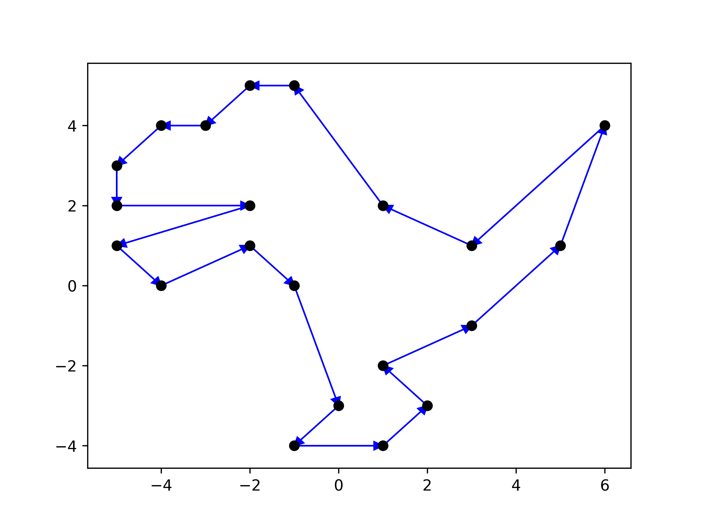
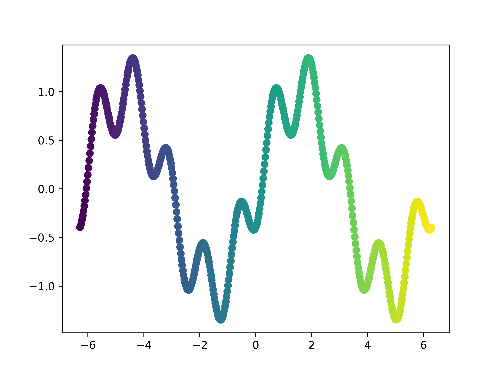
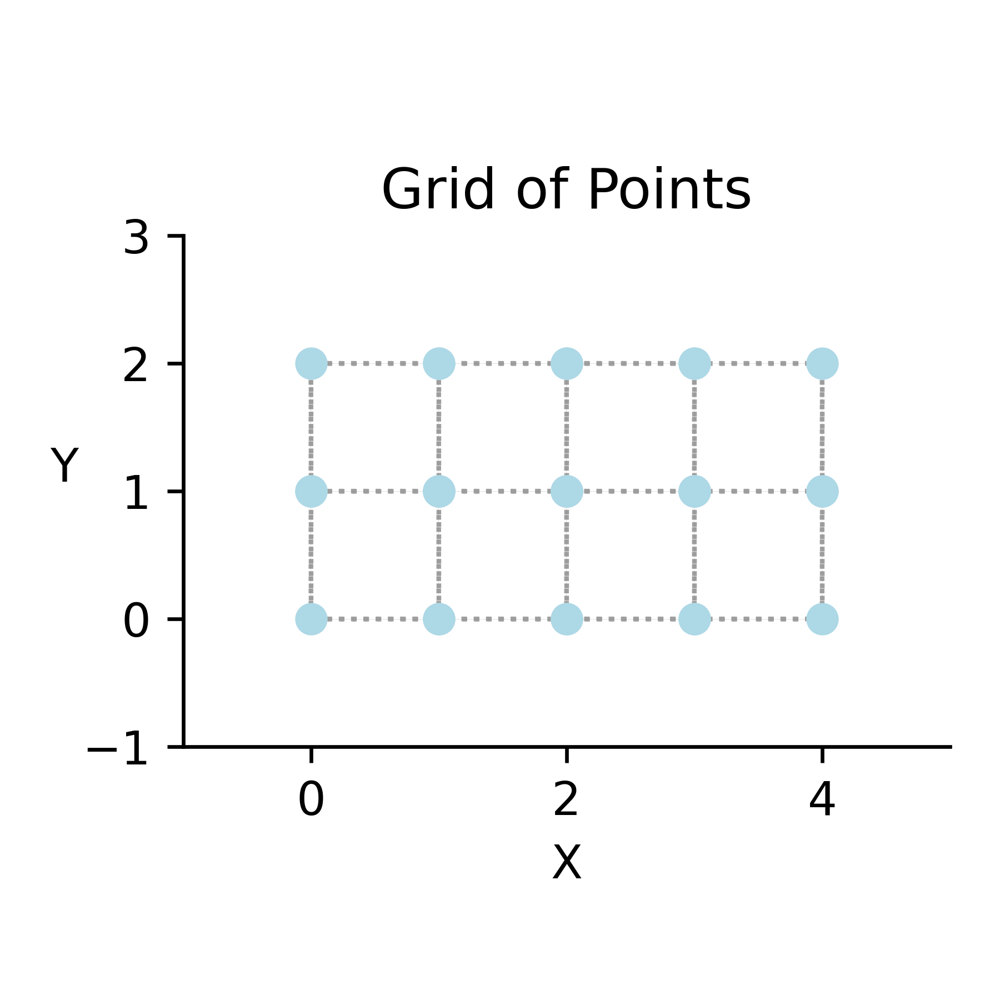
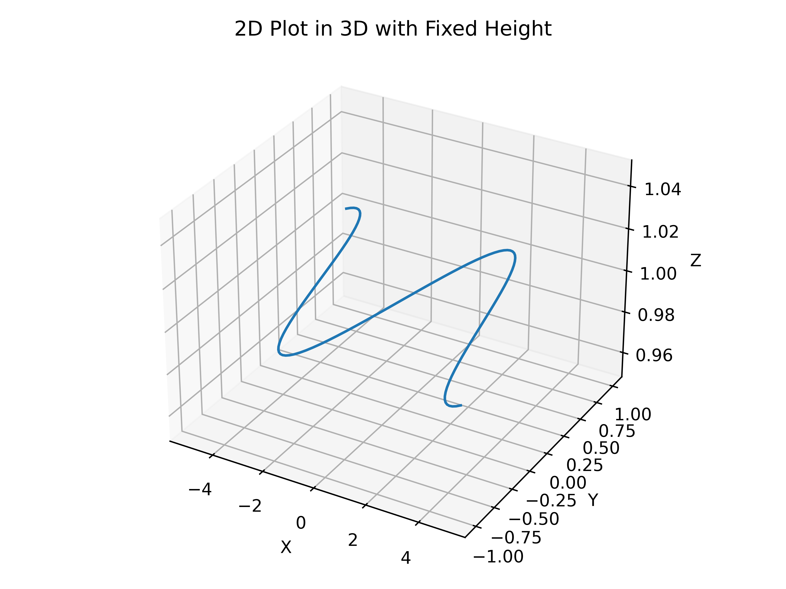
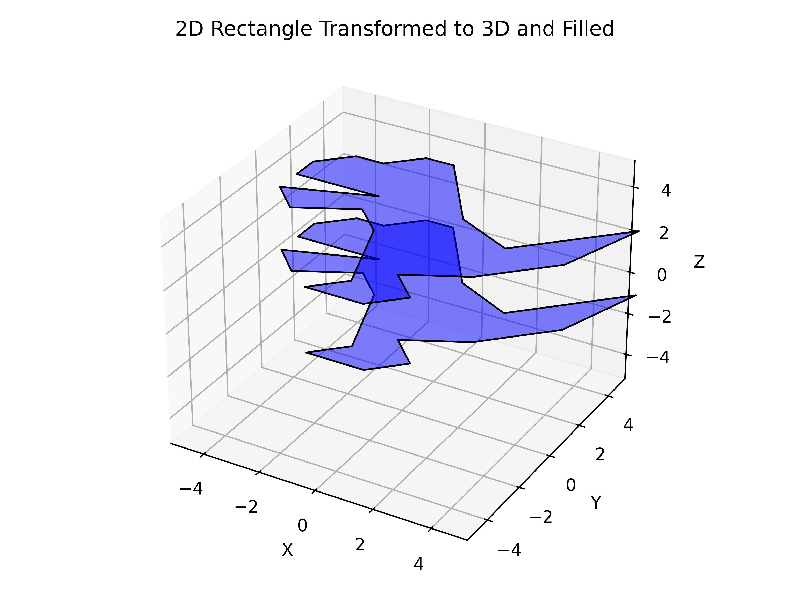
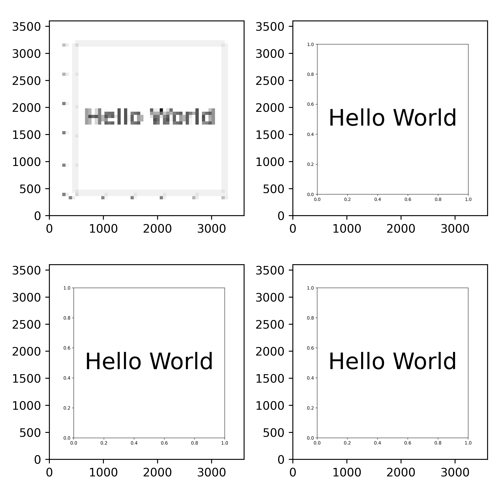

2. Efficient Figure Creation Tips: Abstracting Common Steps
===========================================================

.. _section_2:

In this section
~~~~~~~~~~~~~~~

We will encapsulate common plotting patterns into classes and functions.
Encapsulating logic within functions will allow us to create complex figures with less code and make experiments more enjoyable and less error-prone.

Creating abstractions
~~~~~~~~~~~~~~~~~~~~~

When creating a new figure, you usually start with a new script.

There is nothing wrong with starting with a new script whenever you want to create a new figure.
However, as time passes, you will notice you are repeating yourself.
At the same time, maintaining your code is getting harder and harder.
You'll discover something cool and new and would also like the older code to benefit from it.

The solution for this is to review your code refactor often.
Let's take a practical look at this.

First, we will see how to use the custom-written code to generate complex images.
If you are convinced that it's worth it, there is a second notebook that guides you through the details.

* https://github.com/Kislovskiy/ChartCraftHub/blob/trunk/src/chartcrafthub/chapter_2_0.ipynb
* https://github.com/Kislovskiy/ChartCraftHub/blob/trunk/src/chartcrafthub/chapter_2_1.ipynb

List of Exercises
~~~~~~~~~~~~~~~~~

Exercise 1
----------
**Description:**

Implement a Vector class that represents a vector in 2D space. Use a plot method similar to the Point class.

* A class should have a constructor `__init__(self, ...)`.

* A class should have a method `__str__(self)` that will return a string representation of the object.

* A class should have a method `plot(self, ax, kwargs)` that will plot the vector on the axes.

Exercise 2
----------

**Description**

Using the concepts that you've acquired, create a "common chart" figure like the one below.

Exercise 3
----------

**Description**

Follow the instructions in the notebook `chapter_2_1.ipynb` to create a figure like the one below.

Exercise 4
----------

**Description**

You will be able to create a figure like the one below with ease.

Exercise 5*
-----------

**Description**

The concepts similar to those we've learned about 2D graphics can be applied to 3D.
The star in the exercise means that it's a bit more challenging.

Exercise 6*
-----------

**Description**

We will be able to generate a dyno even in 3D.

Exercise 7*
-----------

**Description**

It is always a good reminder to use a proper DPI and dimensions for the figure.
Create a figure to demonstrate the difference between the default and custom DPI.

Summary
~~~~~~~

We've created a simple example of Plot abstraction in Seaborn, a library built on top of matplotlib.
https://seaborn.pydata.org/generated/seaborn.objects.Plot.add.html

When you watch the examples in Seaborn documentation, it's quite impressive what you can build with matplotlib `source <https://seaborn.pydata.org/examples/index.html>`_.

The goal of this section was to demonstrate Artem's way of navigating complex codebases.

We've learned:
* how to explore the `Figure` and `Axes` objects.

* how to create a simple abstraction for plotting common patterns.

* how to leverage the advantages of structuring code in .py files and functions for seamless reusability across projects.

Contrast the original `anatomy.py <https://github.com/rougier/scientific-visualization-book/blob/master/code/anatomy/anatomy.py>`_ implementation with the refactored structure exemplified in `anatomy_of_figure.py <https://github.com/Kislovskiy/ChartCraftHub/blob/trunk/src/chartcrafthub/anatomy_of_figure.py>`_, highlighting the benefits of functional organization for clarity and maintainability.

In the forthcoming section, delve into the structuring of data visualization projects for portable functionality.

Use this template as a foundation for crafting new scripts: `template.py`.
